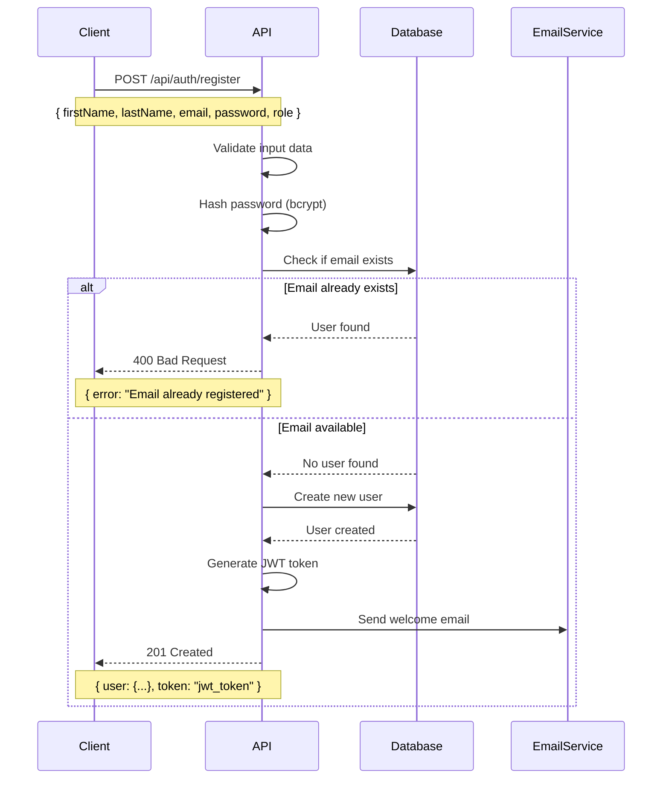
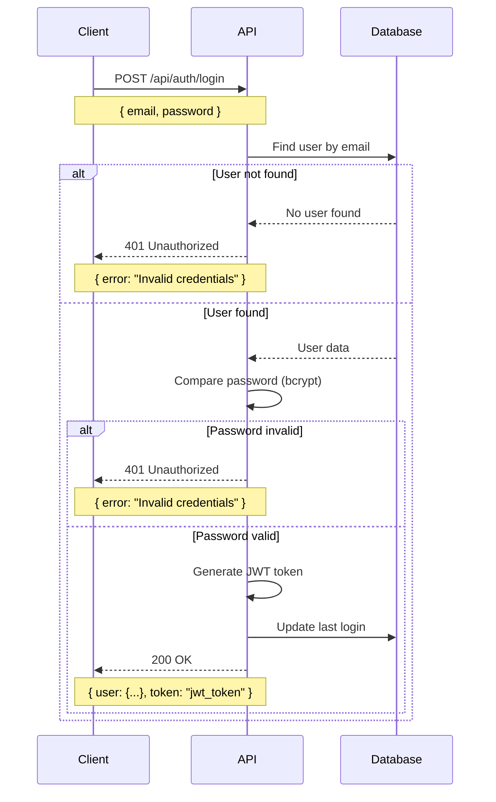
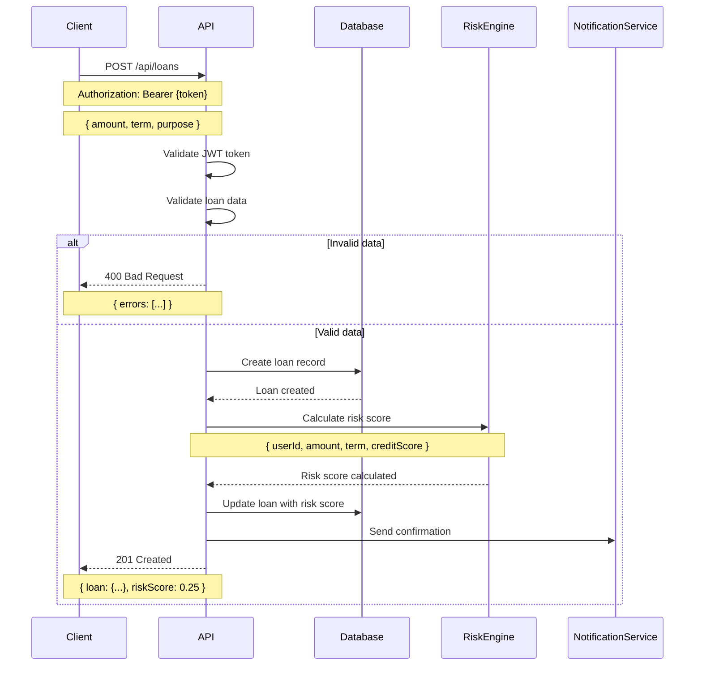
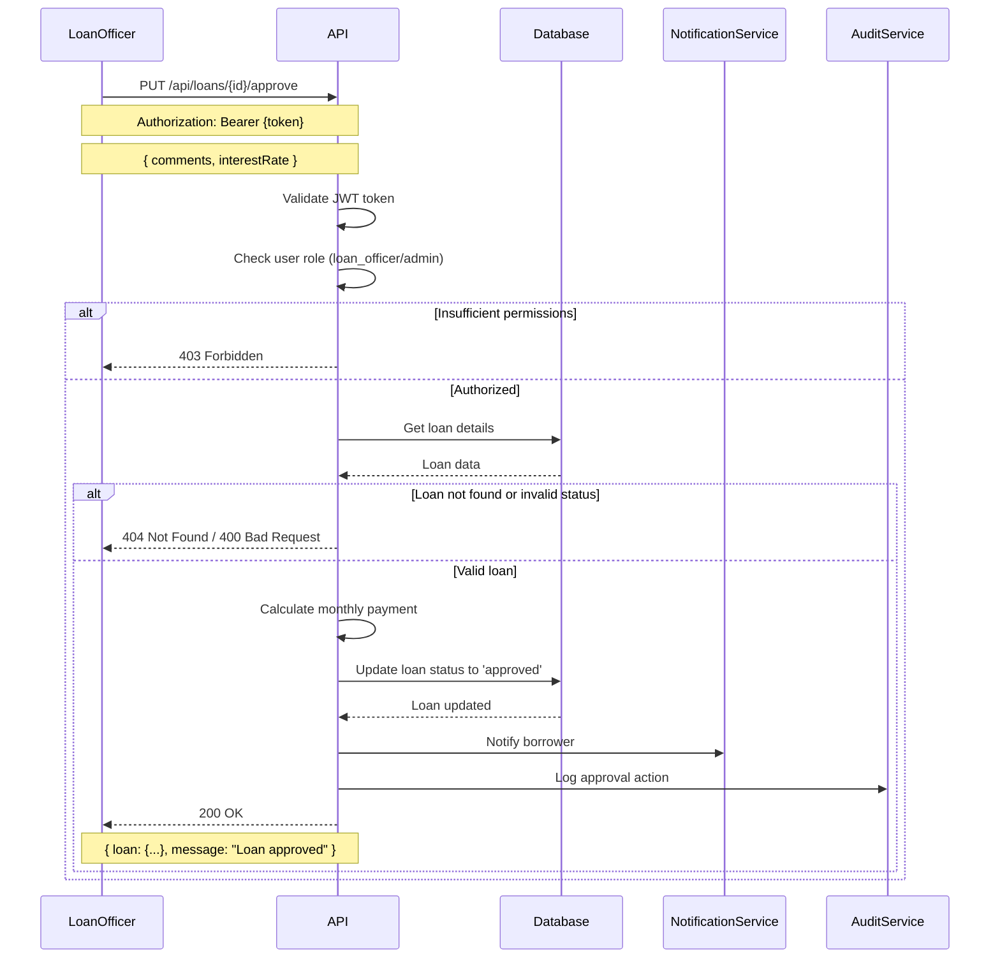
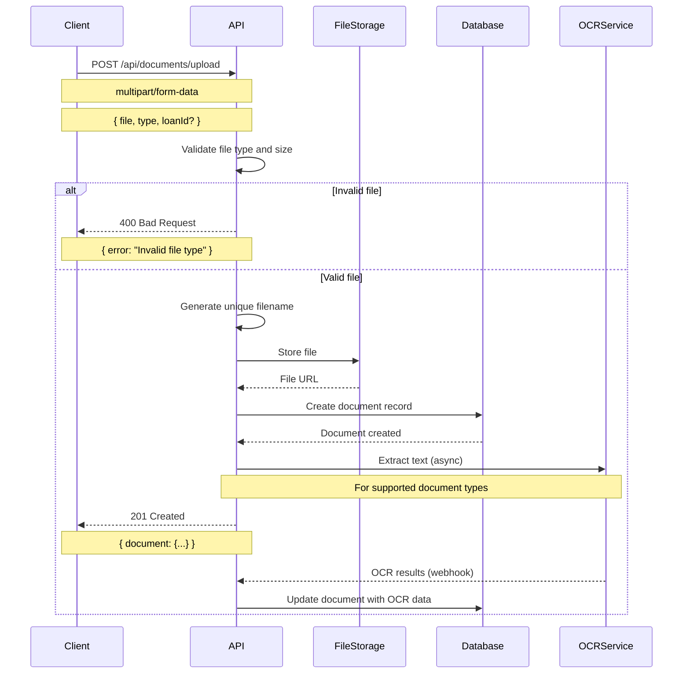
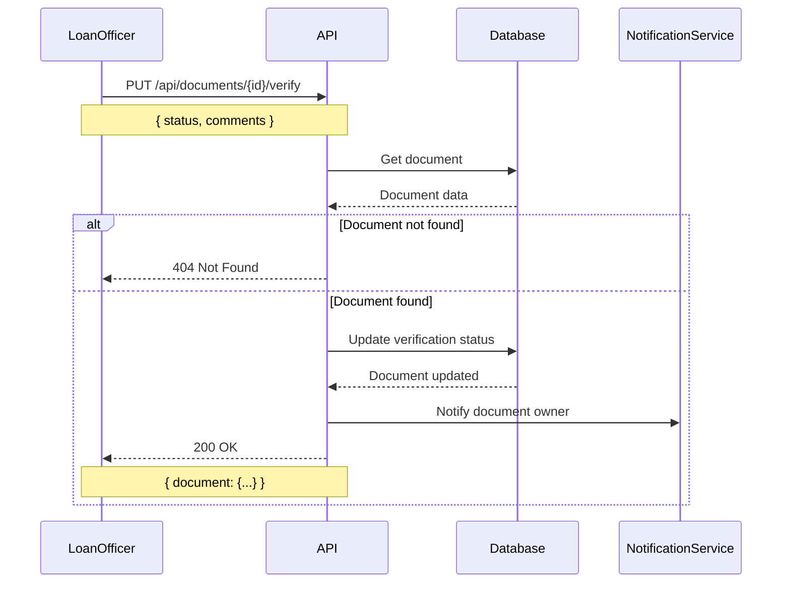
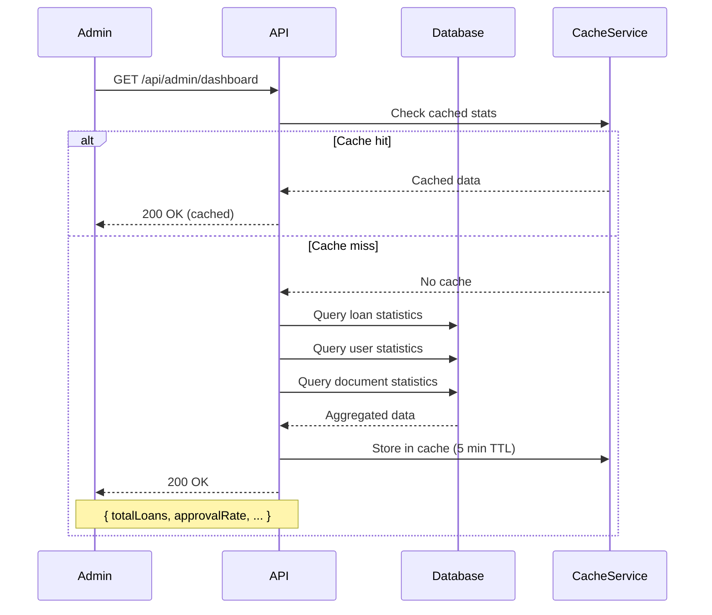

# LoanEase Pro API Flow Documentation

## Overview

This document outlines the API flow patterns, request/response cycles, and business logic for the LoanEase Pro loan management platform.

## Table of Contents

1. [Authentication Flow](#authentication-flow)
2. [Loan Application Flow](#loan-application-flow)
3. [Document Management Flow](#document-management-flow)
4. [Admin Operations Flow](#admin-operations-flow)
5. [Error Handling](#error-handling)
6. [Security Considerations](#security-considerations)

---

## Authentication Flow

### User Registration



### User Login



---

## Loan Application Flow

### Create Loan Application



### Loan Approval Process



---

## Document Management Flow

### Document Upload



### Document Verification



---

## Admin Operations Flow

### Dashboard Statistics



---

## Error Handling

### Standard Error Response Format

```json
{
  "error": {
    "code": "VALIDATION_ERROR",
    "message": "Validation failed",
    "details": [
      {
        "field": "amount",
        "message": "Amount must be between $1,000 and $1,000,000"
      }
    ],
    "timestamp": "2024-01-15T10:30:00Z",
    "requestId": "req_123456789"
  }
}
```

### Error Codes

| Code | HTTP Status | Description |
|------|-------------|-------------|
| `VALIDATION_ERROR` | 400 | Request validation failed |
| `AUTHENTICATION_ERROR` | 401 | Invalid or missing authentication |
| `AUTHORIZATION_ERROR` | 403 | Insufficient permissions |
| `RESOURCE_NOT_FOUND` | 404 | Requested resource not found |
| `DUPLICATE_RESOURCE` | 409 | Resource already exists |
| `RATE_LIMIT_EXCEEDED` | 429 | Too many requests |
| `INTERNAL_SERVER_ERROR` | 500 | Unexpected server error |
| `SERVICE_UNAVAILABLE` | 503 | External service unavailable |

---

## Security Considerations

### Request Security

1. **Rate Limiting**: All endpoints are rate-limited
   - Authentication: 5 requests per minute
   - General API: 100 requests per minute
   - File upload: 10 requests per minute

2. **Input Validation**: All inputs are validated and sanitized
   - SQL injection prevention
   - XSS protection
   - File type validation

3. **Authentication**: JWT tokens with expiration
   - Access token: 15 minutes
   - Refresh token: 7 days

### Data Protection

1. **Encryption**: Sensitive data encrypted at rest
2. **Audit Logging**: All operations logged for compliance
3. **File Security**: Uploaded files scanned for malware

### API Security Headers

```http
X-Content-Type-Options: nosniff
X-Frame-Options: DENY
X-XSS-Protection: 1; mode=block
Strict-Transport-Security: max-age=31536000; includeSubDomains
Content-Security-Policy: default-src 'self'
```

---

## Response Time SLAs

| Operation Type | Target Response Time | Maximum Response Time |
|----------------|---------------------|----------------------|
| Authentication | < 200ms | < 500ms |
| Loan CRUD | < 300ms | < 1s |
| Document Upload | < 2s | < 10s |
| Admin Dashboard | < 500ms | < 2s |
| File Download | < 1s | < 5s |

---

## Monitoring and Alerting

### Key Metrics

1. **Performance Metrics**
   - Response time percentiles (P50, P95, P99)
   - Request rate (requests per second)
   - Error rate percentage

2. **Business Metrics**
   - Loan application rate
   - Approval/rejection rates
   - Document processing time

3. **System Metrics**
   - CPU and memory usage
   - Database connection pool
   - File storage usage

### Alert Thresholds

- Error rate > 5%
- Response time P95 > 2 seconds
- Database connections > 80% of pool
- Disk usage > 85%

---

*This document is maintained by the LoanEase Pro development team and updated with each API version release.*